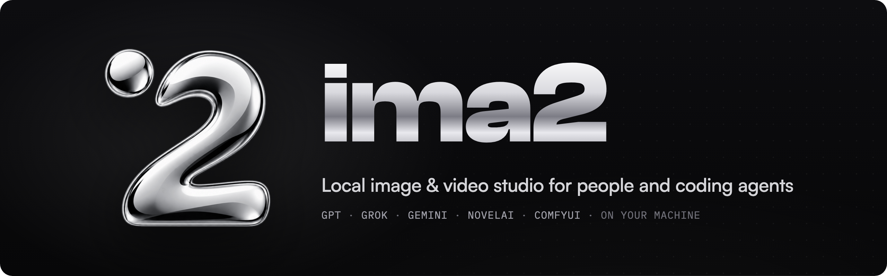
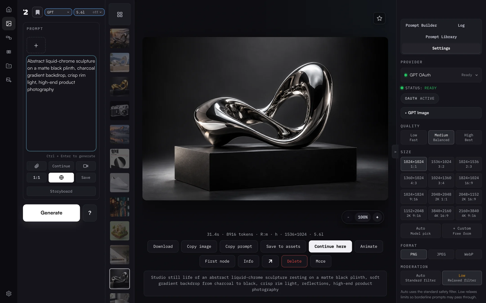
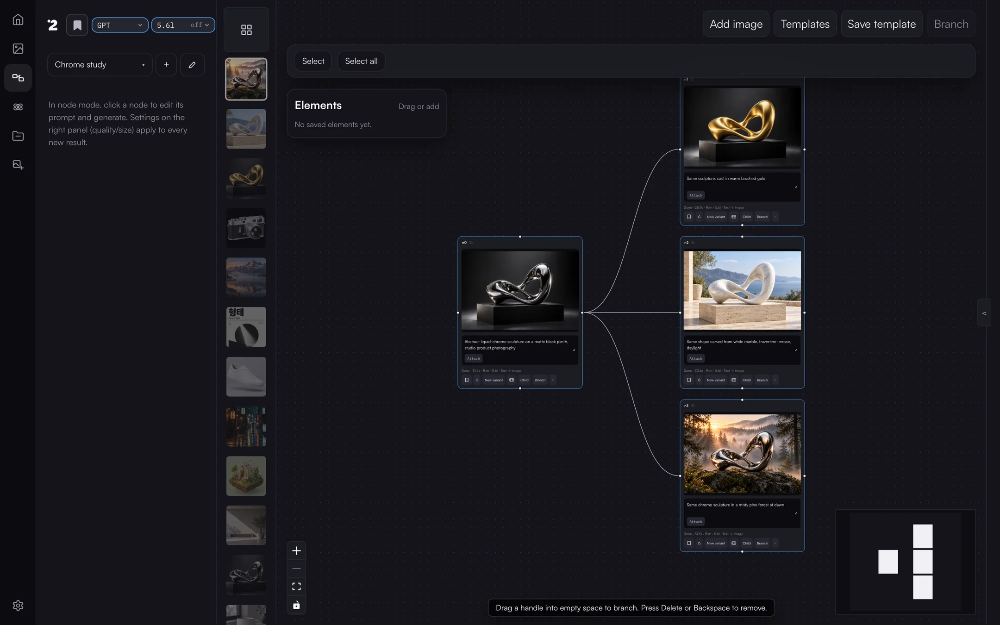
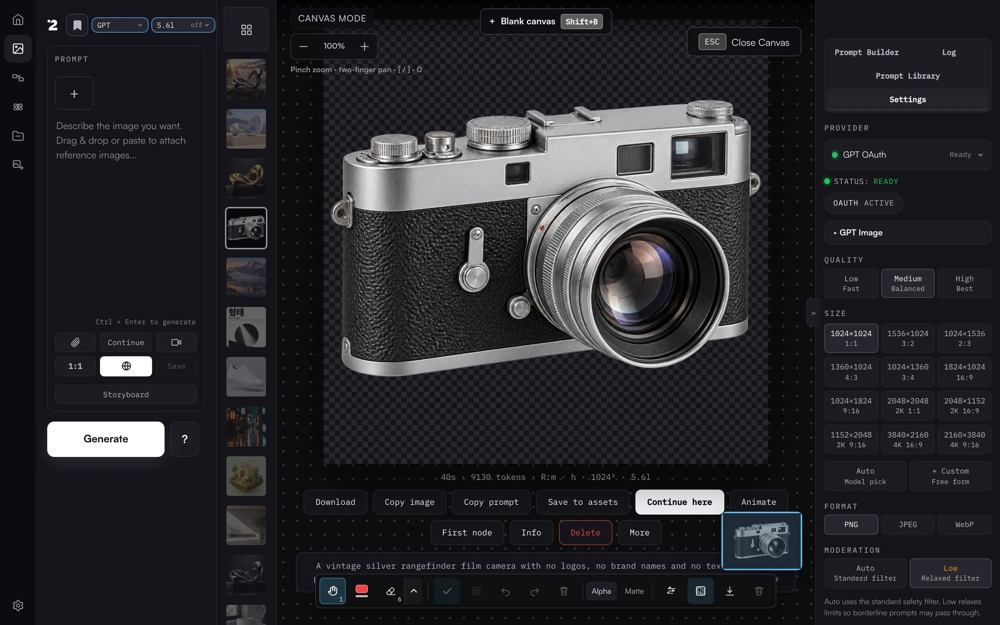
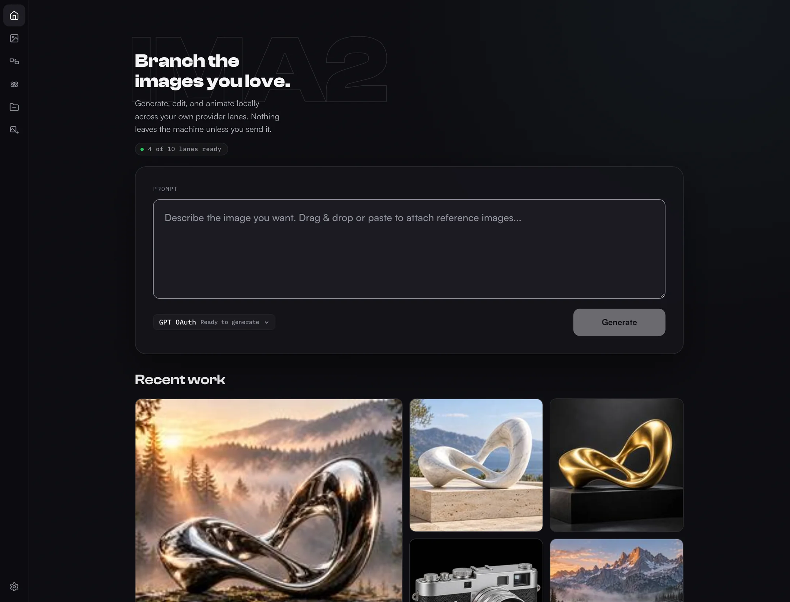

<p align="center">
  
</p>

<h3 align="center">在自己的电脑上生成、分支和精修图像与视频。</h3>
<p align="center">一个本地工作室，把 GPT、Grok、Gemini、NovelAI 和 ComfyUI 放在一起。<br>可以在浏览器、Mac 应用、CLI 中使用，也可以交给你的编程智能体。</p>

<p align="center">
  <a href="https://www.npmjs.com/package/ima2-gen"></a>
  <a href="https://www.npmjs.com/package/ima2-gen"></a>
  
  <a href="https://github.com/lidge-jun/ima2-gen/stargazers"></a>
  <a href="../LICENSE"></a>
</p>

```bash
npm install -g ima2-gen
ima2 serve
```

<p align="center">
  <a href="https://github.com/lidge-jun/ima2-gen/releases?q=desktop&expanded=true"></a>
  <a href="#one-line-installers"></a>
</p>

<table>
<tr>
<td width="42%" valign="middle">

### 创作

写下提示词，附上参考图，选择通道和模型即可。每个结果都会保留提示词、耗时和设置，可以直接复制、接着创作，或者做成视频。

</td>
<td width="58%">
  
</td>
</tr>
<tr>
<td width="42%" valign="middle">

### 在节点图中分支

保留一张满意的图，同时朝多个方向推进。每个分支都记得自己的父节点，原图不会被覆盖。

</td>
<td width="58%">
  
</td>
</tr>
<tr>
<td width="42%" valign="middle">

### 在 Canvas Mode 中精修

标注、擦除、去背景，并以真实的 Alpha 通道导出。一键 GPT 透明化会先由服务器确认真实透明度，再告诉你结果。

</td>
<td width="58%">
  
</td>
</tr>
<tr>
<td width="42%" valign="middle">

### 从首页开始

查看哪些通道已就绪，直接输入提示词，不用翻文件夹就能继续最近的作品。

</td>
<td width="58%">
  
</td>
</tr>
</table>

<p align="center">
  <a href="../README.md">English</a> · <a href="README.ko.md">한국어</a> · <a href="README.ja.md">日本語</a> · <b>简体中文</b> · <a href="README.zh-TW.md">正體中文</a> · <a href="https://lidge-jun.github.io/ima2-gen/"><b>网站</b></a> · <a href="https://lidge-jun.github.io/ima2-gen/docs"><b>文档 →</b></a>
</p>

`ima2-gen` 是一个本地优先的视觉生成运行时和工作室，让人和编程智能体在多个提供商之间运行可复现的图像与视频工作流。它在你的电脑上运行一个小型服务器，把所有作品保存在 `~/.ima2/generated`，只与你连接的提供商通信：OpenAI OAuth/API、Grok OAuth/API、Antigravity CLI、Gemini API、AtlasCloud、MiniMax、NovelAI 以及已注册的 ComfyUI 工作流。Runway 和 Higgsfield 是独立的 MCP 集成。提示词和参考图只会发送给你为每个任务选择的提供商。

## 快速开始

### Mac 应用（Apple Silicon）

桌面应用在 Mac 窗口和菜单栏图标中运行同一个本地服务器和工作室。它使用 Developer ID 签名并通过 Apple 公证，自带运行时，不需要安装 Node.js。

1. 从最新的 [ima2 Desktop 发布页](https://github.com/lidge-jun/ima2-gen/releases?q=desktop&expanded=true) 下载 `ima2-<version>-mac-arm64.dmg`。
2. 打开 DMG，把 **ima2** 拖进 **应用程序** 文件夹。
3. 启动 ima2，在欢迎界面选择一个提供商。

校验和、更新和设置见 [Mac 应用指南](https://lidge-jun.github.io/ima2-gen/docs/desktop)。在 Intel Mac、Windows 或 Linux 上，请使用 npm 或一行安装。

### npm

```bash
npm install -g ima2-gen
ima2 setup
ima2 serve
```

然后打开 `http://localhost:3333`。如果 `3333` 已被占用，`ima2-gen` 会使用下一个空闲端口，并把实际地址写入 `~/.ima2/server.json`，`ima2 open` 总能打开正确的地址。

### 用 CLI 生成第一张图

先设定一次图像和视频的默认目标，然后生成：

```bash
ima2 models
ima2 defaults set image oauth/gpt-6-luna
ima2 defaults set video grok/grok-imagine-video-1.5
ima2 gen "a clean product photo of a red guitar pedal"
ima2 video "a cat playing piano" --duration 5 --resolution 720p
```

在配置 CLI 目标之前，`ima2 gen` 和生成模式的 `ima2 video` 会以 `NO_DEFAULT_MODEL` 停止，除非调用时显式传入 `--model <lane>/<model>` 或 `--provider <lane>`。升级永远不会悄悄切换提供商或计费通道。

<a id="one-line-installers"></a>

### 一行安装（无需 npm）

每个脚本都会检查包声明的 Node.js 最低版本，必要时安装 Node LTS，安装一次 ima2-gen，并在启动 `ima2 serve` 之前运行离线安装检查。它不会停止无关进程，也不会清除全局锁。

**macOS**

```bash
curl -fsSL https://lidge-jun.github.io/ima2-gen/install-mac.sh | bash
```

**Windows (PowerShell)**

```powershell
irm https://lidge-jun.github.io/ima2-gen/install-windows.ps1 | iex
```

**Linux / WSL**

```bash
curl -fsSL https://lidge-jun.github.io/ima2-gen/install-linux.sh | bash
```

<details>
<summary><b>Docker</b></summary>

```bash
docker build -t ima2-gen .
docker run -d -p 3333:3333 -e IMA2_LAN_TOKEN=change-me -v ima2-data:/data ima2-gen
```

compose 用法、所需环境变量和限制见 [Docker 文档](DOCKER.zh-CN.md)。

</details>

<details>
<summary><b>设置、更新与 npx</b></summary>

`ima2 setup` 提供四种认证方式：

1. **GPT OAuth** — 用 ChatGPT 账号登录（图像）
2. **Grok OAuth** — 用 xAI/Grok 账号登录（图像和视频）
3. **Both** — 同时使用 GPT OAuth 和 Grok OAuth
4. **Web setup** — 在 Web 界面中完成全部设置

视频生成需要 Grok OAuth（选项 2 或 3）。如果已经在用 GPT OAuth，可以运行 `ima2 grok login` 添加视频能力，默认使用手动粘贴流程。

更新时，先用 Ctrl+C 停止服务器（或在另一个终端运行 `ima2 stop`），再执行：

```bash
npm install -g ima2-gen@latest
```

Ctrl+C 会干净地退出：关闭数据库、停止子进程并释放文件锁。如果安装失败，请查看 npm 给出的权限提示，或自行停止对应的 `ima2` 进程；安装程序不会批量清理进程。

想用 npx？请看 [npx 快速开始](NPX_QUICKSTART.zh-CN.md)。

</details>

## 能做什么

- **创作**：生成、编辑、复用当前图像、粘贴参考图、从历史继续。打开多模式后，一个提示词可以同时发出多个候选，并看着它们逐格完成。所有控件、多模式配方、Direct 模式和 reasoning effort 都写在 [Prompt Studio 手册](PROMPT_STUDIO.zh-CN.md) 里。 参考图在图像生成中最多 5 张、视频中最多 14 张，大图会在上传前压缩。
- **节点图**：把一张好图分支到多个方向。根节点使用本地参考图，子节点以父节点图像为来源。完成的任务按请求 ID 回填到节点，因此刷新页面或图版本冲突后结果依然能恢复。
- **Canvas Mode**：缩放、平移、悬停高亮的标注、橡皮擦、分组、撤销、便签、背景清理，以及保留 Alpha 或指定底色导出。需要自包含的画布文档就选 **SVG (embedded raster)**，需要真正的矢量路径就选 **Trace to SVG (vector)**。**GPT transparency** 按钮通过 OAuth i2i 通道去除背景，并根据解码后的字节报告 `alphaVerified`。 保存的画布版本不会出现在图库和历史条中，但可以在 Canvas Mode 中重新打开，或作为下一次的参考图。
- **视频**：通过 Grok 视频模型实现文生视频、图生视频和参考生视频，带进度显示和 First/Mid/Last 帧复制按钮。**Storyboard mode** 让连续画面中的人物和场景保持一致。 进度通过 SSE 按 planning → submitted → 进度百分比 → done 显示。故事板模式下，图像关键帧按视频制作来构图，视频片段会继承人物和环境的锁定规则。
- **位图转矢量**：通过 `ima2 vectorize`、AssetGen/Assets 或 Canvas 导出，把扁平位图描成真正的 SVG 路径。
- **NovelAI 双提示词**：选择 NovelAI 后，创作、首页和移动端输入面板会并排显示 **Positive prompt** 和 **Undesired content**。 输入区域窄于 719px 时两栏会上下堆叠。
- **提示词库**：导入本地提示词包、GitHub 文件夹和精选的 GPT-image 提示，并在本地建立索引搜索。
- **Prompt Builder**：用文本后端打磨意图。可在 Settings > Providers 中保持 Auto，或固定后端和模型，**via &lt;backend&gt;** 徽章会显示实际响应的后端。 选择 GPT 后端时，默认模型是 `gpt-6-luna`。
- **本地图库**：所有图像和视频都留在本机，带有按会话划分的历史、生成时间和 reasoning effort 元数据。 默认只显示当前会话，All Images 开关可以展开全部历史，所选的默认范围在会话之间保持不变。
- **浅色和深色主题**：基于 token、满足 AA 对比度的配色，可在浅色、深色和跟随系统之间无闪烁切换。
- **移动端外壳**与**任务可观测**：小屏幕上的应用栏、输入面板和精简的设置开关，以及带安全日志和请求 ID 的进行中、最近任务列表。

Card News 是仅供开发的实验功能，在发布版本中默认隐藏。

### 智能体技能

ima2-gen 内置三个 Markdown 技能，供编程智能体加载，为图像与视频生成、前端素材和设计方向探索提供结构化流程。

| 技能 | 命令 | 内容 |
|------|------|------|
| **Core** | `ima2 skill` | CLI 参考、提示词写法、提供商路由、韩文文本、视频工作流 |
| **Frontend** | `ima2 skill front` | 素材流水线（并行生成、候选挑选、提供商路由）、网页动效与视频、响应式、无障碍、anti-slop，30 多个参考文件 |
| **UI/UX Design** | `ima2 skill uiux` | 以图像为起点的设计方向探索、UX 状态、design-ism、产品性格、DESIGN.md 工作流，21 个参考文件 |

```bash
ima2 skill ls                   # 列出技能
ima2 skill front path          # 输出文件路径（供智能体使用）
ima2 skill front --json        # JSON 包装（供智能体使用）
ima2 skill front refs           # 列出参考模块
ima2 skill front ref motion     # 加载一个参考模块
ima2 skill install --dir <path> # 安装到智能体的技能目录
ima2 skill install --tmp        # 安装到临时目录（备选）
```

## 提供商与模型

| 通道 | 认证 | 图像 | 视频 | 说明 |
|---|---|:-:|:-:|---|
| `oauth` | ChatGPT 登录，由 ima2 直接调用 ChatGPT | ✓ | | 默认通道；GPT-6 规划，`gpt-image-2` 出图，`gpt-6-luna` |
| `api` | `OPENAI_API_KEY` | ✓ | | Responses API `image_generation` 工具，支持蒙版、多模式、节点 |
| `grok` | xAI OAuth（`ima2 grok login`） | ✓ | ✓ | 调用 Images API 前先做网页搜索和规划 |
| `grok-api` | `XAI_API_KEY` | ✓ | ✓ | 直接调用 xAI Images API |
| `gemini-api` | `GEMINI_API_KEY` 或 Vertex 服务账号 | ✓ | | `nano-banana-2`、`nano-banana-pro`，512px 到 4K |
| `agy` | Antigravity CLI | ✓ | | 通过 `agy -p` 使用 Gemini `nano-banana-2` / `nano-banana-pro` |
| `nai` | NovelAI API 令牌 | ✓ | | 四个 NAI Diffusion 模型，文生图 |
| `comfy` | 本地 ComfyUI | ✓ | ✓ | 已注册的图像和视频工作流 |
| `atlascloud` | AtlasCloud API 密钥 | ✓ | | `openai/gpt-image-2` 生成与编辑 |
| `minimax` | MiniMax API 密钥 | ✓ | | `image-01`、`image-01-live` |
| `runway`、`higgsfield` | MCP 连接 | ✓ | ✓ | 独立的 MCP 集成 |

GPT OAuth 通道使用三个 GPT-6 模型：默认 **`gpt-6-luna`**，另有 `gpt-6-sol`，以及推理时间最长、速度最慢的 `gpt-6-astra`。所选模型负责规划画面，`gpt-image-2` 负责出图。`gpt-5.6-luna` 等旧的 OAuth 模型 ID 在已保存的设置和脚本中仍然可用，会映射到对应的 GPT-6 模型。API key 通道保留自己的列表：`gpt-5.6-luna`（默认）、`gpt-6-astra`、`gpt-5.6-terra`、`gpt-5.6-sol`、`gpt-5.5`、`gpt-5.4`、`gpt-5.4-mini`。应用还提供质量（`low`、`medium`、`high`）和审核级别（`auto`、`low`）控制。

<details>
<summary><b>提供商详情（English）</b></summary>

- `provider: "oauth"` signs in with your ChatGPT session and calls ChatGPT's Codex backend from the ima2 server process, with no separate proxy. A GPT-6 model plans the prompt and `gpt-image-2` renders it; Direct mode skips the planner. Transparent backgrounds and image edits run on the same lane.
- `provider: "api"` calls the OpenAI Responses API with the hosted `image_generation` tool.
- `provider: "grok"` calls `https://api.x.ai` directly with the xAI OAuth session stored in `~/.progrok/auth.json`, running mandatory xAI Web Search plus a planner pass (default: `grok-4.3`, configurable in settings or via `--planner-model`) before the xAI Images API call. `grok-4.5` and `grok-4.6` are also selectable. Log in once with `ima2 grok login` or the Settings **Switch Account** button; the session refreshes itself two minutes before expiry.
- `provider: "grok-api"` calls the xAI Images API directly with `XAI_API_KEY` (no OAuth session involved).
- `provider: "nai"` calls the NovelAI image API with a persistent API token (saved in Settings > API Keys or `NOVELAI_API_KEY`; no fixed token prefix is required). Four models: `nai-diffusion-5-full`, `nai-diffusion-5-curated`, `nai-diffusion-4-5-full`, `nai-diffusion-4-5-curated`. Responses arrive as a ZIP archive that ima2 decodes to PNG. Text-to-image only — reference images, edits, and masks are refused rather than silently dropped. Browser and CLI surfaces expose negative prompt, sampler/schedule, steps/guidance/CFG rescale, seed, presets, Auto SMEA, Decrisper, Variety+, and V5 alpha.
- `provider: "agy"` spawns the Antigravity CLI (`agy -p`) to generate images via Google Gemini's `default_api:generate_image` tool (models: `nano-banana-2` and `nano-banana-pro`). Output is fixed at 1024×1024 JPEG, max 3 reference images. No web search, quality, or size controls.
- `provider: "gemini-api"` calls the Google Generative Language API directly. Supports two models: `nano-banana-2` (Gemini 3.1 Flash Image) and `nano-banana-pro` (Gemini 3 Pro Image). Auth is via `GEMINI_API_KEY` env var, web UI key management, or a Vertex AI service account JSON (`VERTEX_SERVICE_ACCOUNT_JSON`). When both an API key and Vertex credentials are configured, Vertex takes priority. Supports variable aspect ratios (1:1 through 21:9) and four resolution tiers (512px, 1K, 2K, 4K); these controls are only honored on the direct API path — the Vertex AI endpoint ignores aspect/size because it does not accept the `response_format` field. Per-model cost differs: `nano-banana-2` (Flash): 512=$0.001, 1K=$0.003, 2K=$0.004, 4K=$0.006; `nano-banana-pro`: 1K=$0.007, 2K=$0.007, 4K=$0.013. No web search or mask controls.
- API-key generation supports classic generate, edit, mask-guided edit, multimode, and node generation.
- Grok generation supports Classic, Node, and Agent flows. If a Classic reference, Node parent image, or Agent current image is present, ima2 switches the final Grok call to xAI image edit so image-to-image context is preserved.

If no provider is specified, the app keeps the current GPT OAuth/default behavior. GPT OAuth defaults to `gpt-6-luna` and API-key generation to `gpt-5.6-luna`; the API-key path also defaults to `low` reasoning and `1024x1024` unless the request passes validated options. Grok image generation defaults to `grok-imagine-image-2.0`.

One caveat on the OAuth Grok lane: xAI documents only `/v1/me` as accepting an OAuth token, so image and video calls to `api.x.ai` with that token ride an undocumented path. It works today — progrok relied on the same path — but it carries no compatibility promise. If xAI closes it, `provider: "grok-api"` with `XAI_API_KEY` is the documented route and stays unaffected.

Grok image generation exposes a Fast/Best model picker (`grok-imagine-image` / `grok-imagine-image-quality`; new sessions start on `grok-imagine-image-2.0`) and a size picker (aspect ratio + 1k/2k resolution). The Settings page prefers the Grok Build weekly credits percentage and reset time from `GET /v1/billing?format=credits`; if that source is unavailable, it falls back to the legacy monthly billing window and `$used/$limit`. A **Switch Account** button starts a device-code OAuth flow (`POST /api/auth/switch`) for re-authenticating without leaving the app.

Grok video generation defaults to canonical `grok-imagine-video-1.5`; `grok-imagine-video` remains available for base-model-only Ref2V, V2V edit, and extension paths, and the legacy `grok-imagine-video-1.5-preview` string is accepted as an alias. Three modes are auto-detected from reference count: text-to-video (0 refs), image-to-video (1 ref), and reference-to-video (2-14 refs; up to 15s on grok-imagine-video-1.5, 10s on grok-imagine-video). 1080p is available for `grok-imagine-video-1.5` prompt-only text-to-video and single image/frame image-to-video; prompt-only 1.5 uses the internal white-canvas I2V shim before the upstream request. Video controls include duration (1-15s), resolution (480p, 720p, 1080p when supported), and aspect ratio (1:1, 16:9, 9:16, 4:3, 3:4, 3:2, 2:3, auto).

</details>

## CLI

<details>
<summary><b>服务器命令（English）</b></summary>

| Command | Description |
|---|---|
| `ima2 serve [--dev]` | Start the local web server; `--dev` enables verbose server diagnostics |
| `ima2 stop [--force]` | Stop the running server safely — graceful admin-API stop first, then SIGTERM/SIGKILL; verifies the advertised pid against `/api/health` so a recycled pid is never killed |
| `ima2 service <sub>` | Background service: `install`/`uninstall`/`start`/`stop`/`restart`/`status`/`logs`/`repair` — launchd on macOS, systemd user unit on Linux, auto-start on login with crash restart |
| `ima2 setup` | Reconfigure saved auth |
| `ima2 status` | Show config and OAuth status |
| `ima2 doctor` | Diagnose Node, package, config, and auth |
| `ima2 doctor image-probe [--json]` | Run sanitized image probes for no-image diagnostics |
| `ima2 open` | Open the web UI |
| `ima2 reset` | Remove saved config |

</details>

<details>
<summary><b>客户端命令（English）</b></summary>

These require a running `ima2 serve`. The CLI covers every server route. The most common ones are below — the [full CLI reference](CLI.zh-CN.md) lists everything (generation, history, sessions, prompt library, annotations, Card News, observability, config).

| Command | Description |
|---|---|
| `ima2 models [--kind image\|video] [--lane <lane>] [--json]` | List live lanes, status, model IDs, and capabilities |
| `ima2 defaults set image\|video <lane>/<model>` | Persist the fail-closed CLI target for image or video generation |
| `ima2 defaults reset image\|video` | Remove a persisted CLI generation target |
| `ima2 gen <prompt> [--model <lane>/<model>]` | Generate from the CLI; requires an explicit target or saved image default |
| `ima2 edit <file> --prompt <text>` | Edit an existing image |
| `ima2 vectorize <input.png> [-o output.svg]` | Trace PNG/JPEG/WebP into a real SVG locally; no server or provider required |
| `ima2 prompt build --message <text> [--backend <backend>] [--model <model>]` | Refine prompt intent through the configured or explicitly selected Prompt Builder backend; requires the local server |
| `ima2 multimode <prompt>` | Multi-image SSE generation |
| `ima2 video <prompt> [--model <lane>/<model>]` | Generate video through a Grok or MCP lane; requires an explicit target or saved video default |
| `ima2 ls [--session <id>] [--favorites]` | List recent history |
| `ima2 show <name> [--metadata]` | Reveal a generated asset |
| `ima2 prompt ls -q <search>` | Search the prompt library |
| `ima2 inflight ls [--terminal]` | List active and recent jobs (alias of `ps`) |
| `ima2 config set <key> <value>` | Write to `~/.ima2/config.json` |
| `ima2 ping` | Health-check the running server |

The server advertises its actual port at `~/.ima2/server.json`. If `3333` is busy, the backend falls back to `3334+` and CLI commands follow the advertised URL. Override discovery with `--server <url>` or `IMA2_SERVER=http://localhost:3333`.

```bash
ima2 models --kind image
ima2 gen "poster" --model oauth/gpt-6-luna --reasoning-effort high
ima2 gen "1girl, blue hair" --model nai/nai-diffusion-5-full --nai-negative-prompt "lowres, watermark"
ima2 vectorize logo.png -o logo.svg --json
ima2 prompt build --message "Make this prompt production-ready" --backend auto --model auto
ima2 edit input.png --prompt "make it rainy" --web-search
ima2 multimode "two cats playing" -n 2
ima2 video "a cat playing piano" --model grok/grok-imagine-video-1.5 --duration 5 --resolution 720p
ima2 video "animate this" --model grok/grok-imagine-video-1.5 --ref photo.png --aspect-ratio 16:9
ima2 inflight ls --terminal
ima2 config set imageModels.reasoningEffort high
```

Full reference: [docs/CLI.md](CLI.md).

</details>

## 配置

配置优先级为 `环境变量 > ~/.ima2/config.json > 内置默认值`。Prompt Builder 的设置保存为 `promptBuilder.backend`（`auto`、`oauth`、`grok`、`api` 或 `grok-api`）和 `promptBuilder.model`。在 Auto 模式下，Prompt Builder 依次尝试 GPT OAuth、Grok、OpenAI API、Grok API，并使用第一个就绪的通道；显式选择的后端会被固定，不可用时返回带类型的错误。

<details>
<summary><b>环境变量（English）</b></summary>

| Variable | Default | Description |
|---|---:|---|
| `IMA2_PORT` / `PORT` | `3333` | Web server port |
| `IMA2_HOST` | `127.0.0.1` | Web server bind host |
| `IMA2_OAUTH_PROXY_PORT` / `OAUTH_PORT` | `10531` | Port of the external GPT OAuth endpoint used with `IMA2_NO_OAUTH_PROXY=1` |
| `IMA2_SERVER` | — | CLI target override |
| `IMA2_CONFIG_DIR` | `~/.ima2` | Config and SQLite location |
| `IMA2_ADVERTISE_FILE` | `~/.ima2/server.json` | Runtime discovery file |
| `IMA2_GENERATED_DIR` | `~/.ima2/generated` | Generated image directory |
| `IMA2_IMAGE_MODEL_DEFAULT` | `gpt-6-luna` | Server fallback image model |
| `IMA2_PROMPT_BUILDER_BACKEND` | `auto` | Prompt Builder text backend (`auto`, `oauth`, `grok`, `api`, or `grok-api`); Settings persists the same value as `promptBuilder.backend` |
| `IMA2_PROMPT_BUILDER_MODEL` | `auto` with Auto backend | Backend-scoped Builder model; Settings persists the same value as `promptBuilder.model` |
| `IMA2_REASONING_EFFORT` | `medium` | Default reasoning effort for the default (GPT OAuth) path; one of `none`, `low`, `medium`, `high`, `xhigh`, `max` |
| `IMA2_NO_OAUTH_PROXY` | — | Set `1` to send GPT OAuth calls to an OpenAI-compatible endpoint on `127.0.0.1:IMA2_OAUTH_PROXY_PORT` instead of ChatGPT directly |
| `IMA2_CODEX_CLIENT_VERSION` | latest `@openai/codex` | Codex client version sent to ChatGPT; the automatic value is never lower than `0.157.0` |
| `IMA2_LOG_LEVEL` | `info` | Normal serve defaults to `info`; dev mode defaults to `debug`; supports `debug`, `info`, `warn`, `error`, or `silent` |
| `IMA2_INFLIGHT_TERMINAL_TTL_MS` | `300000` | Recent terminal job retention for debug views |
| `OPENAI_API_KEY` | — | API key for the `provider: "api"` Responses API image path and auxiliary API-key features |
| `XAI_API_KEY` | — | API key for `provider: "grok-api"` direct xAI Images API path |
| `NOVELAI_API_KEY` | — | NovelAI persistent API token for `provider: "nai"` |
| `IMA2_NAI_IMAGE_MODEL_DEFAULT` | `nai-diffusion-5-full` | Default NovelAI image model |
| `IMA2_NAI_DEFAULT_AUTO_SMEA` | `false` | Default NovelAI Auto SMEA state |
| `IMA2_NAI_DEFAULT_DECRISPER` | `false` | Default NovelAI Decrisper (`dynamic_thresholding`) state |
| `IMA2_API_IMAGE_MODEL_DEFAULT` | `gpt-5.6-luna` | Default image model for `provider: "api"` |
| `IMA2_API_REASONING_EFFORT` | `low` | Default reasoning effort for `provider: "api"` |
| `IMA2_API_IMAGE_SIZE` | `1024x1024` | Default size for `provider: "api"` |
| `IMA2_API_ALLOW_WEB_SEARCH` | `true` | Toggle web search for `provider: "api"` |
| `IMA2_GROK_PLANNER_MODEL` | `grok-4.3` | Grok search/planner model; `grok-4.5`, `grok-4.6` and GPT planners are selectable (settings UI or `--planner-model`) |
| `IMA2_GROK_PLANNER_TIMEOUT_MS` | `900000` | Timeout for the Grok planner call |
| `IMA2_GROK_SEARCH_TIMEOUT_MS` | `300000` | Timeout for the Grok web-search brief (degrades instead of failing) |
| `IMA2_GROK_VIDEO_PLAN_TOTAL_TIMEOUT_MS` | `1500000` | Ceiling on the whole video planning phase (clamped above search + planner) |
| `IMA2_GROK_IMAGE_MODEL_DEFAULT` | `grok-imagine-image-2.0` | Default final Grok image model |
| `IMA2_GROK_VIDEO_MODEL_DEFAULT` | `grok-imagine-video-1.5` | Default Grok video model |
| `IMA2_GROK_GENERATION_TIMEOUT_MS` | `300000` | Timeout for the final Grok Images API call |
| `IMA2_OAUTH_MASKED_EDIT_ENABLED` | `false` | Opt-in feature flag for masked-edit requests on the OAuth path (#31, groundwork only) |
| `GEMINI_API_KEY` | — | API key for `provider: "gemini-api"` direct Generative Language API path |
| `VERTEX_SERVICE_ACCOUNT_JSON` | — | Google service account JSON for Vertex AI auth with `provider: "gemini-api"`; takes priority over `GEMINI_API_KEY` when both are set |
| `IMA2_AGY_BIN` | `agy` on PATH | Explicit path to the Antigravity CLI binary for `provider: "agy"` |
| `IMA2_MAX_PARALLEL` | `24` | Server-wide parallel generation cap |

`IMA2_GROK_PROXY_HOST`, `IMA2_GROK_PROXY_PORT`, `IMA2_NO_GROK_PROXY`, and `IMA2_GROK_RESTART_*` were removed in 3.16 together with the local Grok proxy; they are no longer read, and setting them is harmless.

</details>

<details>
<summary><b>日志模式（English）</b></summary>

`ima2 serve` keeps terminal output intentionally quiet: startup URLs, warnings, and errors stay visible, while request/node/OAuth structured logs are hidden by default.

Use `ima2 serve --dev`, `npm run dev`, or `IMA2_LOG_LEVEL=debug ima2 serve` when you need request IDs, node generation phases, OAuth stream diagnostics, or inflight state transitions. Explicit `IMA2_LOG_LEVEL` and `~/.ima2/config.json` values still override the built-in defaults.

</details>

## 故障排查

<details>
<summary><b><code>ima2 ping</code> 提示无法连接服务器</b></summary>

先运行 `ima2 serve`，再检查 `~/.ima2/server.json`。也可以用 `ima2 ping --server http://localhost:3333` 直接指定地址。

</details>

<details>
<summary><b>GPT OAuth 登录不成功</b></summary>

重新运行 `ima2 setup`（选项 1），确认 `ima2 status`，然后重启 `ima2 serve`。

</details>

<details>
<summary><b>在代理/VPN 网络中反复出现 <code>fetch failed</code></b></summary>

GPT OAuth 请求由 `ima2 serve` 进程直接发往 `chatgpt.com`。需要代理的网络中，请开启代理客户端的 TUN/TURN 类模式。如果做不到，请在启动服务器的终端里同时设置 `HTTPS_PROXY` 和 `NODE_USE_ENV_PROXY=1`；Node.js 22.21+ 和 24+ 只有在设置第二个变量时才会读取 `HTTPS_PROXY`；更早的 Node.js 两个都会忽略，请改用 TUN 模式。在 Windows 上，还要检查开机自启的网络拦截工具，包括 SecretDNS 这类 DNS/分片绕过工具，即使浏览器看起来正常，它们也可能破坏 OAuth 或图像响应。

</details>

<details>
<summary><b>图像生成报 <code>API_KEY_REQUIRED</code></b></summary>

使用 `provider: "api"` 前，请设置 `OPENAI_API_KEY` 或配置 API key。默认的 GPT OAuth 路径不需要 API 密钥。

</details>

<details>
<summary><b>返回 <code>EMPTY_RESPONSE</code> 或没有图像数据</b></summary>

运行 `ima2 doctor image-probe --json > ima2-image-probe.json`，并把脱敏后的 JSON 附在 Issue 中。如果是 GPT OAuth 问题，请在 `ima2 serve` 运行时同时记录 `ima2 gen "고양이" --model oauth/gpt-6-luna --no-web-search --json` 和 `ima2 gen "고양이" --model oauth/gpt-6-luna --json` 的结果。不要分享 ChatGPT Cookie、OAuth token 文件、API 密钥、原始上游响应、提示词历史或生成的 base64。

</details>

<details>
<summary><b>大尺寸参考图失败</b></summary>

大的 JPEG/PNG 会在上传前自动压缩。如果仍然失败，请转换成分辨率更低的 JPEG 或 PNG 再试。浏览器路径不支持 HEIC/HEIF。

</details>

<details>
<summary><b>更新后看不到以前的图库图片</b></summary>

新版本把生成的图像从安装包目录移到了 `~/.ima2/generated`。运行 `ima2 doctor`，并参阅 [找回旧图片](RECOVER_OLD_IMAGES.zh-CN.md)。

</details>

<details>
<summary><b>GPT OAuth 通道里找不到或拒绝 GPT-6 模型</b></summary>

GPT OAuth 通道使用你的 ChatGPT 方案开放的 GPT-6 模型。请更新 ima2-gen，用 `ima2 gpt login` 重新登录，再用 `ima2 models --kind image` 检查。如果只有某个模型持续失败，请切换到默认的 `gpt-6-luna`。

</details>

<details>
<summary><b>应用在另一个端口打开</b></summary>

如果请求的端口被占用，`ima2-gen` 会使用下一个空闲端口，并记录在 `~/.ima2/server.json`。如果端口意外变成 `3457`，可能是你的 shell 从其他本地工具继承了 `PORT=3457`。运行 `unset PORT`，或用 `IMA2_PORT=3333 ima2 serve` 启动。

</details>

更多答案见 [FAQ](FAQ.zh-CN.md)。

## 文档

- [开发者文档站点](https://lidge-jun.github.io/ima2-gen/docs) — 概览、快速开始、架构、模式、提供商、CLI、配置和服务器 API
- [CLI 参考](CLI.zh-CN.md) · [API 参考](API.zh-CN.md) · [Prompt Studio 手册](PROMPT_STUDIO.zh-CN.md) · [FAQ](FAQ.zh-CN.md) · [找回旧图片](RECOVER_OLD_IMAGES.zh-CN.md)

## 开发

```bash
git clone https://github.com/lidge-jun/ima2-gen.git
cd ima2-gen
npm install
npm run dev
npm run typecheck
npm test
npm run build
```

`npm run dev` 会构建 UI，并以 `--watch` 和详细诊断日志启动 TypeScript 服务器。`npm run typecheck`、`npm run build:server` 和 `npm run build:cli` 用来验证 TypeScript 的构建路径。 节点模式和 Canvas Mode 默认包含在打包后的 UI 中。

Web 界面通过一个 `GET /api/events` Server-Sent Events 连接接收所有进度。多模式、节点和视频请求以异步 POST（`202 { requestId }`）提交，并通过共享事件总线多路复用，因此并发任务不会撞上浏览器 6 个连接的上限。没有发送 `async: true` 的 CLI 客户端仍会收到按请求划分的 SSE 流。

### 运行要求

<!-- runtime-install:generated:start -->
| Contract | Value |
|---|---|
| Node engine | `>=22` |
| npm toolchain | `npm@11.18.0` |
| Release Node | `24.17.0` |
| CLI entry | `bin/ima2.js` |
| OpenAI SDK | `^7.4.0` |
| Express | `^5.1.0` |
<!-- runtime-install:generated:end -->

安装程序会从包的元数据读取 Node.js 最低版本，并在启动服务器之前运行离线安装检查。

<details>
<summary><b>桌面应用构建（Electron，English）</b></summary>

`desktop/` wraps the same local server and UI in a menubar/tray app for macOS, Windows, and Linux. It supervises `server.js` as a child process (attaching to an already-running server on the configured port instead of starting a second one) and adds a native settings window: port, open at login, start hidden, menubar-only (macOS), keep-server-on-close, log level, config directory.

```bash
cd desktop
npm install
npm run prepare:app     # builds server + CLI + UI at the repo root
npm start               # run unpackaged
npm run dist:mac        # dmg + zip (Apple Silicon / arm64)
npm run dist:win        # nsis + zip
npm run dist:linux      # AppImage + deb
```

Only the macOS app is distributed today, for Apple Silicon. `.github/workflows/desktop.yml` runs in three ways: a push to `dev` builds an unsigned macOS validation build, a manual dispatch builds signed and notarized installers without publishing anything, and a `desktop-v*` tag push builds, verifies, and publishes the desktop release. Trusted macOS builds require `MAC_CSC_LINK`, `MAC_CSC_KEY_PASSWORD`, `APPLE_ID`, `APPLE_APP_SPECIFIC_PASSWORD`, and `APPLE_TEAM_ID`; missing or invalid authentication fails the build instead of producing an unsigned success.

For a signed macOS verification build without publishing, run:

```bash
gh workflow run desktop.yml --ref <reviewed-branch> -f platform=mac
```

The workflow verifies Developer ID, team, architecture (arm64), hardened runtime, secure timestamp, nested signatures, Gatekeeper and stapled notarization tickets. It checks the apps recovered from the final ZIP and DMG against the original signed content, then exports `ima2-macos-signature-proof` reports and installer SHA-256 hashes. Failed verification blocks installer upload. Only a `desktop-v*` tag push creates and publishes a release.

Signing credential imports run on disposable GitHub-hosted macOS. The builder cleans successfully imported keychains; if import/setup fails before its cleanup registration, runner destruction is the final cleanup boundary. Local recovery should reuse an existing login-keychain identity in the same unlocked session, rather than importing credential packages into a persistent machine. This does not require changing automatic locking or key access rules.

Windows Authenticode remains separate and uses `WIN_CSC_LINK` / `WIN_CSC_KEY_PASSWORD`; Windows builds without them are unsigned.

</details>

## 贡献者

- [@lidge-jun](https://github.com/lidge-jun) — maintainer
- [@ree9622](https://github.com/ree9622) — moderation controls, Windows fixes, structured logging
- [@Charley-Peng](https://github.com/Charley-Peng) — API cache fix (#74)
- [@philiptaron](https://github.com/philiptaron) — Nix flake (#81)
- [@aorying](https://github.com/aorying) — upstream validation error surfacing (informed TS migration direction)
- [@PARKJONGMlN](https://github.com/PARKJONGMlN) — batch comparison matrix design (#80)

## 许可证

MIT
